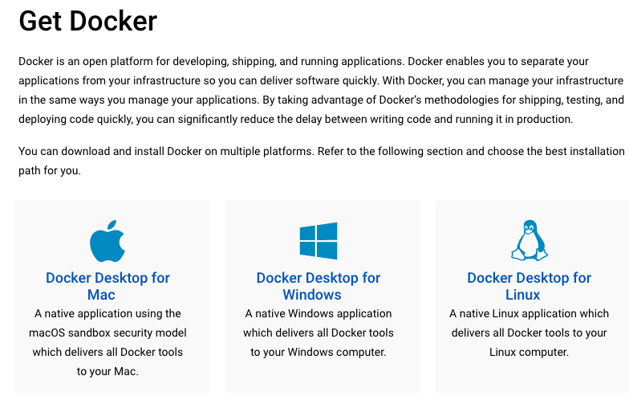

## Descripción

- API acceso recursos candidatos postulados a posición dev...

## Versión

- v1.0.0

## Introducción
La siguiente guia está dirigida al departamente de TI para la puesta en ejecución de las siguientes aplicaciones: API, APP y gestor de base datos.

Para la facil ejecución de cada una de las isntancias siga los siguientes pasos:
### Desarrolllo:

#### Estructura del proyecto
- script:
- src:
    - candidates
       - dto     
           - create-candidates.dto.ts
           - update-candidates.dto.ts
       - entities 
          - candidates.entities.ts
       - candidates.controllers.ts
       - candidates.models.ts
       - candidates.services.ts
       - candidates.types.ts
    - database
       - database.models.ts
    - utils
      - handledErrorDatabase.ts
    - app.controllers.ts
    - app.modules.ts
    - app.services.ts  
    - main.ts
- .env    
- .gitignore
- .dockerignore
- docker-compose.yml
- Dockerfile
- nest-cli.json
- package.json
- package-lock.json
- tsconfig.json
- tsconfig.build.json

### API:

1. Requerimientos:
    - 4 GB de RAM
    - Procesador de 64-bit (*preferiblemente*)
    - 2 GB Almacenamiento (*preferiblimente*)

2. Instalar dependecias. *vease:* [`Instalación de dependencias`](#instalación)

3. Instale Docker.
    *vease el siguiente enlace:* [`Intalación de docker`](https://docs.docker.com/get-docker/). 
  
    .  

4. Para instalar y ejecutar el API junto al gestor de base de datos, *vease:* [Ejecutar API y Base de Datos](#ejecutar-api-y-base-de-datos)
    
    Al ajecutar en una terminal, desde el directorio raiz del proyecto, el comando: `$ docker compose up` se instalará (si no existen) las dependencias de MySql:latest (*en su última versión. Descarga la imagen desde dockerhub*) y se construirá una imagen del proyecto del API y lanzará un contenedor (*llamado API*) con dos conetenedores (*llamados: br_test_api, br_test_db*).

    Para destruir los contenedores creados ejecute el comando: `$ docker compose down`. 
    
    Nota: *Si destruye el contenedor 'br_test_db' perderá los datos, ya que destruirá la base de datos*


### Producción:

Si no desea ejecutar el producto en contenedores: 

1. *Vease:* [`Ejecutar API`](#ejecutar-api) 
2. compile la aplicación
    ```bash
    $ npm run build  
    ```
3. Tome la carpeta 'Dist' ubicada en el directorio raiz del proyecto y coloquela en su hosting preferido.
4. Ejecute el siguiente script
    ```bash
    $ npm run start:prod
    ```  

## Alcance
- Objectivos
    - Gestionar los cadidatos a puesto lectivos para el area de TI.
    - Acceso mediante interfaz de usuario de los candidatos en evaluación.

- Beneficios: 
    - Datos centralizados de candidatos.
    - Disponibilidad de acceso a los datos.

## Proposito
Facilitar al area de Capital Humano una herramienta que provea acceso a datos de candidatos que postulan a puesto dentro de la institución para su evaluación previa.

Dar solución a los requerimiento expuesto en este proyecto logrando la agilización de desempeño de Capital Humano en la evaluación de nuevo personal en TI.

## Requerimientos Funcionales
- Construir base de datos:
  -Nombre batos: testbr_db

  Campos:
  - id 
  - Cedula 
  - Nombres
  - Apellidos
  - Fecha de Nacimiento
  - Trabajo actual
  - Expectativa Salarial
  - fecha de creación
  - fecha de actualzación
  - fecha eliminado

- Al momento de agregar un registro validar que el identificar del candidato no pueda ser duplicado.
- Falitarle al usuario la visualización de los registros generados.
- Desarrollo de una aplicación que pueda ser ejecutada en cualquier navegddor de internet actualizado.
- Agregar, eliminar y editar cualquer registro.

## Requerimientos no funcionales
- Niveles de seguridad no contemplados para este esenario.
- Compatibilidad con navegadores: No compatible con versiones antiguas: IE, etc.

## script db 
Gestor de Base de Datos: 

MySql: 8

```sql
create database if not exists testbr_db;

create table if not exists testbr_db.candidatos (
  id int not null auto_increment,
  nombres varchar(60) not null,
  apellidos varchar(60) not null,
  cedula varchar(11) not null,
  fecha_nacimiento datetime(6) not null,
  trabajo_actual varchar(100) null,
  expectativa_salarial decimal(8,2) null,
  createdAt datetime(6) not null default(CURRENT_TIMESTAMP(6)),
  updatedAt datetime(6) not null default(CURRENT_TIMESTAMP(6)) ON UPDATE CURRENT_TIMESTAMP(6),
  deletedAt datetime(6) null default(null),
  primary key (id),
  unique index cedula_unique (cedula) visible,
  unique index id_unique (id asc) visible);

```
##  Instalación
instalar dependencias
```bash
$ npm install
```

## Ejecutar API

```bash
# development
$ npm run start

# watch mode
$ npm run start:dev

# modo producción
$ npm run start:prod
```

## Ejecutar API y Base de datos

```bash
# Poner en marcha API Y DB
$ docker compose up

# Si falla el proceso en Docker al ejecutar el script de base de datos (regularmente en Mac OS).
# Copiar el script al contenedor para crear la base de datos (se insertan datos de prueba)
$ docker cp script/francisco_valdez_prueba.sql br_test_db:/francisco_valdez_prueba.sql

# Acceda al contenedor de base de datos
$ docker exec -it br_test_db bash

# Una vez dentro login a mysql. Nota: password: "br_test_password"
$ mysql -u root -p

# Una vez logueado ejecutar el stript
$ source francisco_valdez_prueba.sql

```

### Documentación del API: 
#### [Open API - Swagger](http://localhost:3000/api)
 Ej: <http://localhost:3000/api>

### Soporte

- Autor - Francisco Valdez F.
- Email: <satelite0ster@gmail.com>

#### Enlaces 

[Demostración APP](http://br-test-app.s3-website-us-east-1.amazonaws.com/) 

[Documentación API: OpenAPI](https://br-test-api-5deyn.ondigitalocean.app/api)

